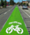

# Black Avenue - Gallagator Bicycle Corridor Concept

Imagine a safe and convenient bicycle corridor connecting Sacajawea Middle School through the University Neighborhood via the Gallagator Trail, and to Downtown, the Fairgrounds, the Cannery District via Black Avenue. 

Such a corridor would cover some 22,000 residents within a mile of the corridor, and connect to the western neighborhoods via the Oak Street shared-use path. 

100% paved this route would function as a low-stress cycling corrider for all riders, twelve months per year, providing major north-south connectivity through Bozeman's densest and most cycleable neighborhoods both Bozeman's current and future needs.

Bozeman’s bike share is already nearly ten times the national average. Bozeman’s densely populated historic neighborhoods generally have calm, quiet streets favorable for biking.

This map shows a concept of a bicycle corridor connecting the Cannery District, Fairgrounds, Northeast Neighborhood, Downtown, Bon Ton, University Neighborhood, MSU campus, and southern neighborhoods together into a single bicycle corridor. The orange outline shows a one-mile buffer around the corridor, or those living with six minutes of the corridor.

## Why

* **Let's Be Healthy, Y'all**
  * High levels of cycling in the Netherlands are estimated to result in economic savings of about 3 percent of GDP (the United States spends about 18% of GDP on healthcare). If the United States achieved similar levels of cycling, it's estimated 125,000 lives would be saved per year through better health. 
  * Approximately 13% of Americans suffer form asthma. Most air pollution in America now comes from transportation, not factories. Some 200,000 annual deaths in America are attributed to poor quality, of which vehicle emissions is a leading contributor.

* **Dollars and Sense**
  * Mobility options attract talent. A recent study found 63% of millenials want to live in a place where they don't need a car. Attracting talent is an essential ingredient in sustaining Bozeman's innovative and strong economy.
  * As America doubled the size of its road network between 1970 and 2010, the percentage of income that a typical family spends on transportation has also doubled from 10% to 20%. A great way to improve Bozeman's affordability is to reduce car dependence.
  * Biking improves property values (citation needed)

* **The Environment**
  * In the United States, transportation recently overtook power generation to become the most-polluting sector of our economy. 
  * Combining health and economic benefits, the City of Copenhagen estimates that each mile driven by car costs the city $0.20, while each mile biked earns the city 42 cents. 

* **Fun**
 * Many people choose to live in Bozeman because they love being outside and active. Creating more opportunities for healthy, safe active transportation and recreation in Bozeman will contribute to Bozeman's livability and appeal.

## How

The single most important action that we can take right now is to develop a vision and plan for the bicycle corridor, and to gain commitment from city leaders to plan for and invest in this future. Providing a safe crossing across Kagy Boulevard will be expensive. If Kagy is reconstructed for $15m without a plan for a safe passage for pedestrians and cyclists on the Gallagator, this plan is good as dead.

### Infrastructure Investment

Building the corridor to be safe, comfortable, and functional 365 will require $3 – $4m in investment to create new infrastructure for cyclists. Listed in order of difficulty:

1.  Colored Bike Facilities on Black Avenue. Existing "sharrows" are ambiguous By painting brightly colored green lanes in the middle of the street, both cyclists and drivers will be made aware that cyclists are encouraged to ride in the middle of the street. These colored lanes would be painted all the way from Tamarack to where Black turns to gravel (present) and to the intersection with the Gallagator in the future. (Cost) Additional Colored Bike Facilities to be installed on Garfield Street from the Gallagator to MSU's Centennial Mall, and Grant Street from Willson to campus.

2.  Six Stop Signs. Intersections at East Story Street, East Olive Street, and East Lamme Street should be converted to four-way stops. Combined with the Idaho Stop bike law (see Policy Change, below), this traffic control change will give bicycles a safe, prioritized passage through the corridor. (Actually, note to self, let's make this a "cyclists yield all others stop" situation...?)

3.  Two Stop Lights. As recommended by the 2019 Downtown Improvement Plan, stoplights should be installed at Black and Babcock and Black and Mendenhall.

4. Shared Use Path through the Gallatin County Fairgrounds connecting Tamarack Street to Oak Street

5. Fill the Gallagator Gap. Per Bozeman's Transportation Master Plan, "This is a crucial missing link for the Bozeman trail system, creating a sizeable gap in the Gallagator Trail. The former rail bed is on Museum of the Rockies property. Efforts by the city and other groups have been unsuccessful due to concerns with the living history display. This can be effectively mitigated though design."

6. Pave the Gallagator. 

7.  Elevated, High Visibility Crossing Treatments (elevated crossings, tunnels, separated grade crossings, etc.) on Oak Street, Willson Avenue at Garfield, Willson Avenue at Lincoln, Kagy Boulevard, and Graf Street.

### Policy Change

To give cyclists priority and convenience when traveling through the corridor, the newly created four-way stops should be converted to four-way "Idaho Stops" where cyclists may treat the Stop Sign as a Yield Sign (with clear signage on all intersection legs indicating that cyclists may not stop). This will require changing the law.

### Winter Maintenance

To be usable year-around, these facilities must be kept free of accumlated snow. MSU does an excellent job maintaining its sidewalks using sweepers and sand. The Bozeman Department of Public Works would need to aquire the appropriate equipment and budget to able to keep the boulevard and (paved) Gallagator free of snow.

## How to get Involved

This exciting vision is within our reach, but it will require a critical mass of Bozeman residents to size the vision and get involved.

* Attend a BABAB meeting and express your support for the Gallagator/Black Bicycle Corridor.
* Attend the city of Bozeman's December Capital Improvement Plan budgeting sessions and ask for the following projects from Bozeman's 2017 Transportation Master Plan to be funded:
  * **BB-2 Black Ave** ("Creates a longer north south route using the Gallagator Trail and Sourdough Trail. Currently has shared lane markings and some signage.")
  * **SP-11 Gallagator Trail Paving** ("This project seeks to pave the unpaved portions of the Gallagator Trail. Advantages would include winter maintenance and a more reliable experience year-round.")
  * **SP-4 Gallagator Extension** ("This is a crucial missing link for the Bozeman trail system, creating a sizeable gap in the Gallagator Trail. The former rail bed is on Museum of the Rockies property. Efforts by the city and other groups have been unsuccessful due to concerns with the living history display. This can be effectively mitigated though design. This particular segment may not have a significant role in campus transportation, however its importance is still significant. This is estimated to be a longer term project coordinated with redevelopment of the Museum.")
  * **SP-23 Gallagator Extension** ("Extend Gallagator Trail to the south.")
